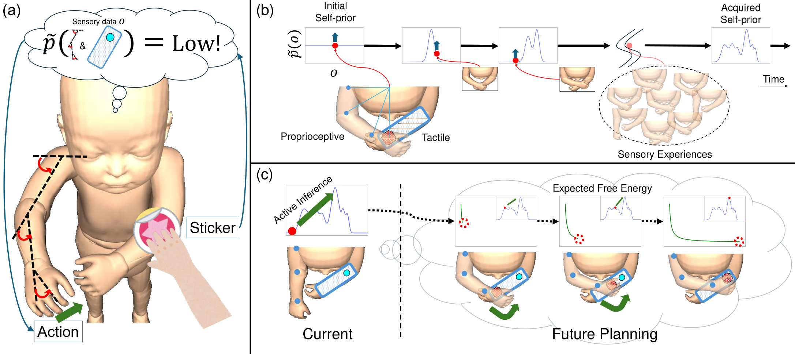

# Self-Prior

***Emergence of Goal-Directed Behaviors via Active Inference with Self-Prior***

Dongmin Kim, Hoshinori Kanazawa, Naoto Yoshida, and Yasuo Kuniyoshi

arXiv preprint URL: https://arxiv.org/abs/2504.11075

---

* A
full-body infant illustration is used for clarity, the actual experiment was conducted in a pseudo-3D
environment.

Our work demonstrates how intrinsically motivated behaviors can spontaneously arise
through an agent's continuous interaction with its environment and the development of sensory experience-driven priors.

* (a) Action occurs when the current situation differs from the self-prior.
* (b) The preferred prior is autonomously learned through experience (self-prior).
* (c) A reaching behavior toward a sticker emerges to minimize free energy.

Please refer to the environment-specific code for instructions on running the program.

## Code
* [Discrete experiment code][discrete]
* [Continuous experiment code][continuous]

## Acknowledgement
This work was conducted at the [Intelligent Systems and Informatics Laboratory (ISI Lab)][lab], The University of Tokyo, Japan.

This work was supported by JST, PRESTO Grant Number JPMJPR23S4, Japan.

[paper]: https://arxiv.org/abs/2504.11075
[repo]: https://github.com/kim135797531/self-prior
[lab]: https://www.isi.imi.i.u-tokyo.ac.jp

[discrete]: https://github.com/kim135797531/self-prior-discrete
[continuous]: https://github.com/kim135797531/self-prior-continuous
